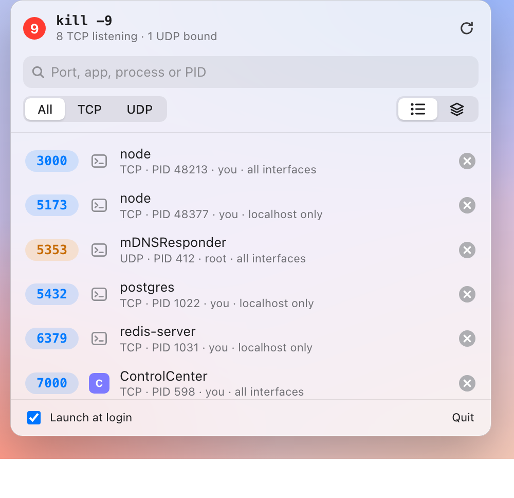

<div align="center">

# ⑨ Kill9

**Free your ports.**

A tiny macOS menu-bar app that shows what's listening on every port and stops it in one click.<br>
It's a friendly GUI for `kill -9 $(lsof -ti tcp:3000)`.

[**Download for macOS**](https://github.com/masb3/kill9/releases/latest/download/Kill9.zip) · [Website](https://masb3.github.io/kill9/) · [Build from source](#build-from-source)



</div>

```
Error: listen EADDRINUSE: address already in use :::3000
```

Seen that one before? Click ⑨ in the menu bar, type `3000`, press **Return**. Done.

## Features

- **Every port at a glance.** Listening TCP and bound UDP ports, with IPv4 and IPv6 merged. Refreshes every 3 seconds while the window is open.
- **Port, then Return.** Type a port number and press Return to stop everything using it. Search also matches app names, process names and PIDs.
- **Gentle first, firm second.** Kill sends SIGTERM, then SIGKILL after 1.5 seconds if the process won't exit. Force Kill sends `-9` straight away.
- **Grouped by app.** Helper processes roll up into their parent `.app`, so Docker or your IDE appears once with all its ports.
- **Know what you're stopping.** Process name, app icon, PID, user, and whether it listens on localhost only or on all interfaces.
- **Right-click for more.** Open in browser, copy the PID or kill command, reveal in Finder.
- **Stays out of the way.** No Dock icon, optional launch at login. Shortcuts: <kbd>⌘R</kbd> refresh, <kbd>⌘Q</kbd> quit.

## Install

1. Download [**Kill9.zip**](https://github.com/masb3/kill9/releases/latest/download/Kill9.zip) and unzip it.
2. Move `Kill9.app` to your Applications folder.
3. Kill9 isn't notarized by Apple yet, so macOS blocks the first launch. Allow it once:
   ```bash
   xattr -dr com.apple.quarantine /Applications/Kill9.app
   ```
   Or try to open it, then click **Open Anyway** in System Settings → Privacy & Security.
4. Open Kill9. The ⑨ icon appears in your menu bar.

Requires macOS 13 Ventura or later. Release builds are for Apple Silicon; on an Intel Mac, build from source.

## Build from source

You need macOS 13+ and the Xcode Command Line Tools.

```bash
./build-app.sh
open build/Kill9.app
# optional: cp -R build/Kill9.app /Applications/
```

For quick dev iteration: `swift run`. Or open `Package.swift` in Xcode and press ⌘R.

## Notes

- Kill9 can only stop processes owned by your user. For root-owned ones it shows the `sudo kill -9 <pid>` command to run instead.
- Releases are built by the **Build** GitHub Action. Run it from the Actions tab and enter a version to publish a release.
